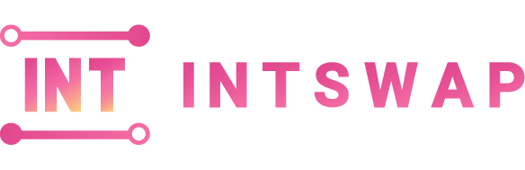

# 

 

Intswap is an NFT AMM with aggregated liquidity providers and solution for NFT liquidity.

## Advantages

**Decentralization**: Intswap’s core modules are all implemented by on-chain smart contracts, which not only ensures the openness and transparency of the transaction process, but also effectively protects the rights and interests of all parties involved in the transaction.

**Strong Interoperability**: Intswap implements NFT AMM with aggregated Liquidity Providers, which reduces the complexity of third-party protocol aggregation and greatly enhances the network value of the protocol

**Royalty Supported**: Intswap supports NFT Creators to set a reasonable Royalty Ratio. The protocol will allocate the royalty based on its own economic model system and combined with this parameter to ensure the Creator’s sustainable income

**Innovative Business Model**: Intswap adopts a modular staking pool design to enable NFT Creators to quickly customize their appropriate incentive strategies to optimize their business model and create a virtuous community.

## Core Innovative

### NFT AMM with Intswap Providers (LPs)

In Intswap, all LPs provide liquidity to NFT AMMs in an aggregated way, earn market making fees in the form of compound interest, and use an interest-bearing LP Fungible Token as the provider's liquidity certificate.

### Concentrated Liquidity

In order to meet the trading characteristics of the NFT market, we have designed a AMM with concentrated liquidity . AMM price ranges can be set to a specific range to reduce trading slippage. In addition, price ranges are allowed to be updated during the market making process, which greatly increases the flexibility.

### Liquidity Mining for NFT LP incentive

We have designed a modular NFT LP incentive platform and designed two specific incentive strategies. Intswap's LPs can participate in profit sharing through STAKE LP Tokens to increase their mining revenue.